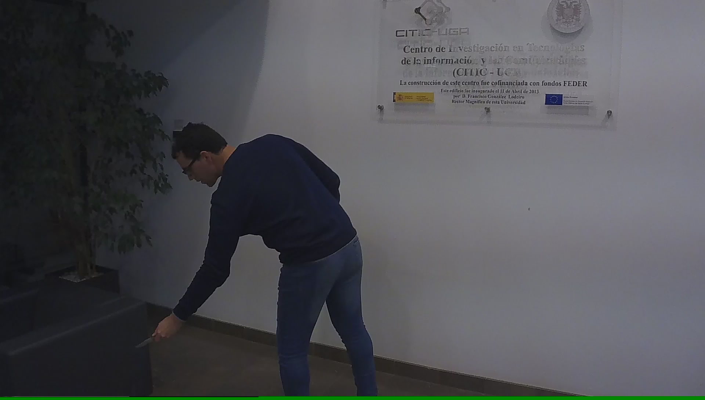

# Gun detector
This is repository contains a YOLOv5 model trained to detect these objects:
`
'pistol', 'smartphone', 'knife', 'monedero', 'billete', 'tarjeta
`.

## Setup
1. Clone repository:
> `git clone https://github.com/blurry-mood/gun-detector`
2. Setup repository:
> `cd gun-detector`
> `./setup.sh`
3. Download the dataset (this may take a while):
> `./data/setup.sh`
4. Clone yolov5 repository:
> `git clone https://github.com/ultralytics/yolov5.git`  
> `pip install -r yolov5/requirements.txt`

## Use:
- To train a YOLOv5 model, use this command:
> `python yolov5/train.py --img 640 --batch 16 --epochs 3 --data src/yolo_data.yaml --cfg yolov5s.yaml`

- To detect parking spots from an image, use this command:
> `python yolov5/detect.py --source img.jpg --weights trained/yolov5s_640.pt --img 640 --iou-thres 0.33 --conf-thres 0.25  --max-det 200`  
The resutlts will be found in `yolov5/runs/detect`

- To convert model to ONNX, use this command:
> `python yolov5/export.py --weights trained/yolov5s_640.pt --img 640 --batch 1 --simplify --iou-thres 0.33 --conf-thres 0.25 --include onnx`
### **Note**:
- For more insights, check [train](https://github.com/ultralytics/yolov5/wiki/Train-Custom-Data), [export](https://github.com/ultralytics/yolov5/issues/251). 
- To train a new model, specifiy `src/yolo_data.yaml` as a value for this flag  ``--cfg``.


## Data Samples:
Raw image                  |  YOLOV5 predictions
:-------------------------:|:-------------------------:
 | 
 | 


## Model summary:
| Model | mAP@.5 | mAP@.5:.95 | GFLOPs |
| --- | --- | --- | --- |
| [YOLOv5s](trained/yolov5s_640.pt) | N/A | N/A | 16.4 |


## References:
```
Pérez-Hernández, F., Tabik, S., Lamas, A., Olmos, R., Fujita, H., Herrera, F. (2020) Object Detection Binary Classifiers methodology based on deep learning to identify small objects handled similarly: Application in video surveillance. Knowledge-Based Systems, 194, 105590. doi.org/10.1016/j.knosys.2020.105590
```


